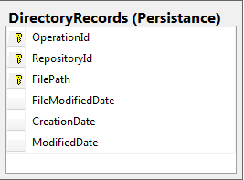

# Directory Tables

|Image|Explanation|
|-----|-----------|
||Stores data on files that have been processed into the Harvester. Operations will look for new files as well as rerun old files that have been modified since the last time they were used.|