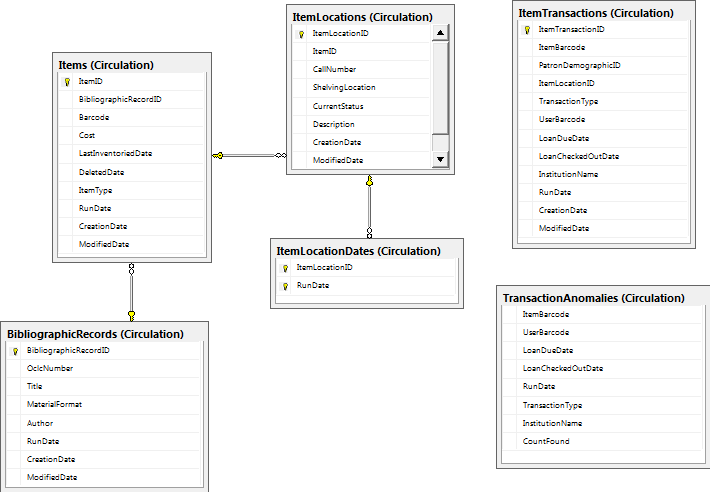
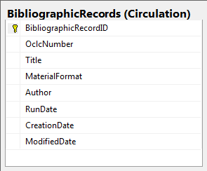
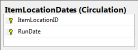
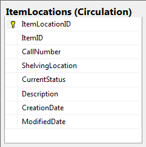
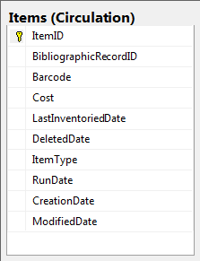
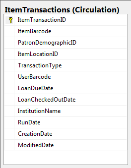
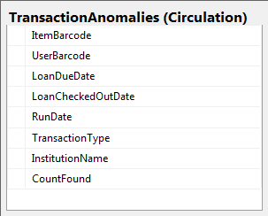
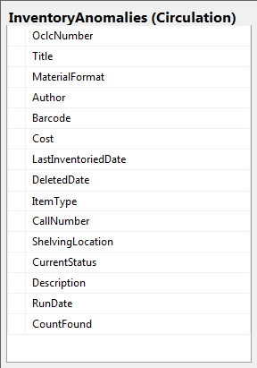

# Circulation Tables

|Image|Explanation|
|-----|-----------|
||Contains all WMS Inventory and Transaction Data|
||Stores the most recent record of bibliographic information for a inventoryItem|
||Stores ItemLocationID's and their run dates. Is used to link items to a specific location at a specific time.|
||Stores more specific data about an item at a certain location such as Current Status and CallNumber|
||Stores data about individual items. If a item is already found in this table it will be overwritten with a newer RunDate|
||Item Transactions use Inventory and Patron data to link transactions to specific persons and specific items in the database.|
||Stores records that were found more than once in a data file or have no ItemBarcode. These transactions are matched based on every field. The number found in the import file are also recorded.|
||Stores Records from WMSInventory that cannot be used because they either have an invalid barcode or no title.|