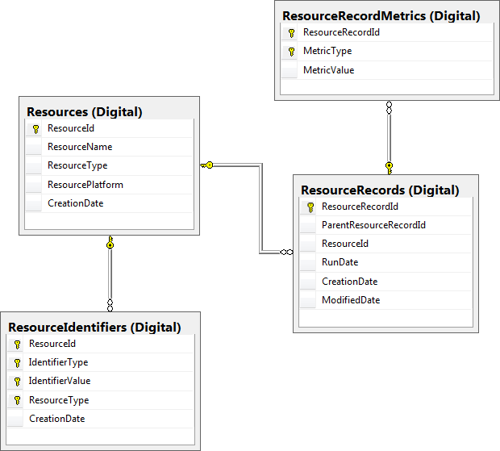
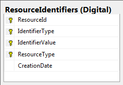
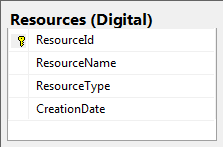
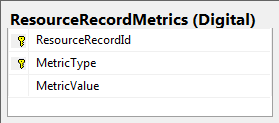

# Digital Tables

|Image|Explanation|
|-----|-----------|
|||
||Stores IdentifierTypes and values for Resources such as ISSNs and ISBNS. Duplicate Identifier Type and Identifier Values pairs are not allowed. If a record has no Identifiers we generate one by combining parts from its Name (First Letter + Length + Hashcode + Last Letter)|
||Stores a single instance of each resource.  A one to many relationship to ResourceIdentifiers. A one to many relationship with ResourceRecords|
||Stores Resources with a recordId so that it's time entered into the database can be linked to ResourcesRecordMetrics. Will store multiple rows of the same resource but each with a different recordId. One to many relationship to ResourcesRecordMetrics.|
||Stores Metric data about each resource at a certain time. Metrics are values like FullTextHtmlRequests, FullTextPdfRequests, FullTextTotalRequests with a quantity associated with it.|