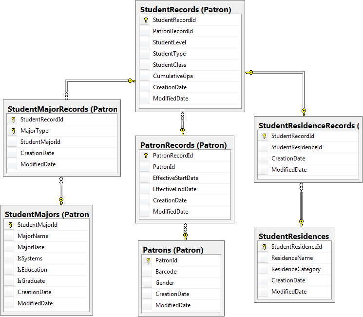
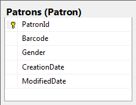
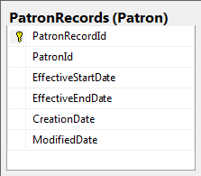
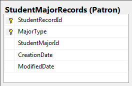
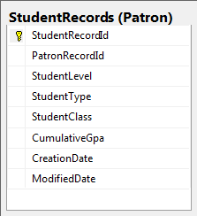
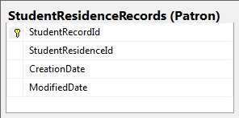
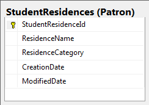

# Patron Tables

|Image|Explanation|
|-----|-----------|
|||
||Has a Gender and Barcode for each individual Patron which is marked by an individual patronId. Has one to many relationship to PatronRecords.|
||Stores multiple time specific PatronRecordId's for each Patron. It also includes an effectiveStartDate and effectiveEndDate of that time period.|
||Stores data about a students major at a specific time.|
||Stores Data about a student at a specific time.|
||Stores records of a student at a specific time at a specific residence.|
||Stores Residence Names and their ResidenceCategory(Commuter, OnCampus, OffCampus, AwayFromCampus)|